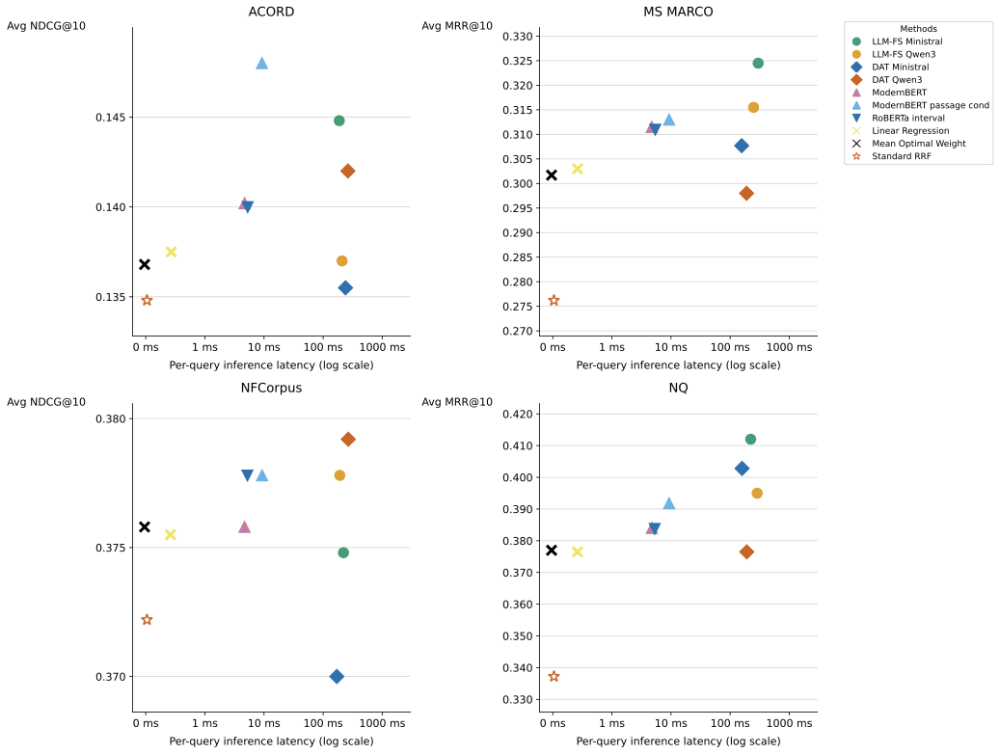

# Query-Based Reciprocal Rank Fusion

## Introduction

Reciprocal Rank Fusion (RRF) combines sparse and dense retrievers in hybrid search, but standard RRF uses a fixed, uniform weight regardless of query. Query-aware methods assume the per-query optimal weight is a single point — an assumption we test empirically.

This repo studies dynamic fusion weight prediction across four datasets and four sparse–dense retriever pairs. We treat the per-query optimal weight as a **set-valued object** rather than a point, and benchmark ten prediction methods of increasing complexity: a dataset-level constant, linear regression, fine-tuned encoder LMs, and LLMs (zero-shot and few-shot).

Compared against a per-query oracle bounding achievable performance, three findings emerge:

1. **The per-query optimum is usually an interval, not a point** — for 10–38% of queries, standard RRF's weight (0.5) already falls inside it, explaining why uniform fusion is a strong baseline.
2. **Headroom above standard RRF is real but hard to capture** — no method recovers more than 25% of it in most configurations.
3. **Latency vs. quality is dataset-dependent, not monotone** — motivating the tiered [decision framework](#decision-framework-for-fusion-method-selection) below.

---

## Decision Framework for Fusion Method Selection

Per-query inference latency clusters into three tiers: **T0/T1** need no forward pass, **T2** runs a fine-tuned encoder (~6 ms), and **T3** calls an LLM (~215 ms). The quality-vs-latency plot shown below (see [IR Performance–Latency Tradeoff Analysis](#ir-performancelatency-tradeoff-analysis)) motivates this tiering. Sub-tiers share latency/infra but differ in training requirements.

| Tier | Sub-tier | Method | Latency (95% CI) | Infra | Training data | Query-aware | Top-1 retrieval-aware |
|---|---|---|---|---|---|---|---|
| T0 | – | RRF (w=0.5) | <1 µs | CPU | no | no | no |
| T1 | T1a | Mean Optimal Weight | <1 µs | CPU | yes | no | no |
| T1 | T1b | Linear Regression | 265 ± 3 µs | CPU | yes | yes | no |
| T2 | T2a | Small Encoder LM | 5.24 ± 0.04 ms | GPU (self-host) | yes | yes | no |
| T2 | T2b | Small Encoder LM | 8.46 ± 0.02 ms | GPU (self-host) | yes | yes | yes |
| T3 | T3a | DAT (zero-shot) | 205.5 ± 8.6 ms | GPU / LLM API | no | yes | yes |
| T3 | T3b | Few-shot LLM | 225.4 ± 8.4 ms | GPU / LLM API | yes | yes | no |

**Two prerequisite checks:**

- **Dataset sensitivity** — compute `(Oracle − RRF) / Oracle` (headroom) and compare it to a threshold δ, the minimum gain that justifies a higher tier.
- **Training data** — T1, T2, and T3b all need labeled queries; without labels, only T0 or T3a apply.

**Tier properties:**

- **T0** — use when no labels or LLM are available, or as a zero-latency default.
- **T1** — learned weight on CPU. T1a gives a small, consistent gain on responsive datasets; T1b performs similarly. Good when no GPU is available or a simple deployable model is preferred.
- **T2** — same latency class across sub-tiers (~6 ms); on responsive datasets, recovers much of the achievable gain at a fraction of LLM latency. T2b is competitive across datasets and the strongest Tier 2 method overall, and is best when a GPU and top-1 passages are available at fusion time.
- **T3** — LLM-based. T3a needs no labeled data; T3b is strongest on NQ and MS MARCO. Run-to-run variance is high, especially with sampling temperature > 0. Best when fusion is the final stage and the latency budget allows an LLM call — otherwise that budget may better serve a downstream re-ranker. Non-retrieval-aware methods (T0–T2a, T3b) depend only on the query.



*Per-query latency vs. ranking quality across four datasets (MRR@10 for MS MARCO and NQ, nDCG@10 for ACORD and NFCorpus). Each point averages over 2×2 retriever combinations per dataset.*

---

## Configuration

All scripts resolve data, results, and model paths through environment variables. Set these before running any script:

| Variable | Used for | Default (cluster) |
|---|---|---|
| `BASE_DATA_DIR` | Dataset CSV files | `/path/to/your/dataset` |
| `BASE_RESULTS_DIR` | Output `.trec` / metrics files | `/path/to/your/results` |
| `BASE_EXPERIMENT_DIR` | Saved model checkpoints | `/path/to/your/experiment` |

Copy `.env.local`, fill in your paths, and save it as `.env`:

```bash
cp .env.local .env
# edit .env with your paths
```

Scripts load `.env` automatically via `utils/env.py`. You can also add the variables directly to your shell profile (`~/.zshrc` / `~/.bashrc`) or set them in your SageMaker environment settings.

---

## Data Collection

### Optimal Fusion Weights (Ground Truth)

To collect the optimal fusion weights for each dataset, use one of the following scripts:

* `rrf_mrr_best_weights_all_weights_final.py`
* `rrf_ndcg_best_weights_all_weights_final.py`

Choose the script based on the dataset characteristics:

* If each query has **only one relevant document**, use the **MRR-based** script.
* If each query has **multiple relevant documents**, use the **nDCG-based** script.

**Note**: A query can have more than one optimal weight that achieves the highest MRR or nDCG score. However, some queries may not have any optimal weights because their MRR or nDCG score is 0 across all weight ranges.

---

## Fusion Strategy Evaluation
### Fuse Search Results Use Specific Weight

After obtaining the predicted optimal weights from the model, use:

```
helper_4_fuse_results_wrrf.py
```

This script fuses search results from different retrievers, including:

* **Sparse retrievers**: BM25, RM3
* **Dense retrievers**: Bi-encoder, Qwen3

The fused results are saved in **TREC format**.

Finally, use:

```
helper_5_ir_metrics.py
```

to compute evaluation metrics such as **nDCG** and **MRR**.

---


## Experiments

Organized by the latency tier introduced in the [Decision Framework](#decision-framework-for-fusion-method-selection) below.

### T0: Standard RRF

Both sparse retrievers (`bm25`, `rm3`) and dense retrievers (`biencoder`, `qwen3`) use equal fusion weights (0.5).

Run with:

```
helper_4_fuse_results_wrrf.py
```

Set the following parameters in the script:

```python
use_fixed_weight = True  # Enable fixed fusion weights
sparse_weight = 0.5
```

Then manually switch the retriever names as needed:

```python
sparse_name = "rm3"      # Options: "bm25" or "rm3"
dense_name = "qwen3"     # Options: "biencoder" or "qwen3"
```

---

### T1a: Mean Optimal Weight

For each dataset, use the **mean optimal fusion weight** collected from its training set to fuse the search results.

The execution logic is the same as **T0 (Standard RRF)** above — the only difference is that you set `sparse_weight` to the dataset-specific mean optimal weight instead of `0.5`.

---

### T1b: Linear Regression (Ridge)

TF-IDF features → ridge regression, predicting the mean optimal weight directly from query text.

See: [`experiment/ridge-regression/ridge-regression-mean-best-weight`](./experiment/ridge-regression/ridge-regression-mean-best-weight)

---

### T2a: Small Encoder LM (query-only)

Fine-tuned encoder LMs that predict a fusion weight from the query text alone, with two training objectives:

| Directory | Encoder | Target |
|---|---|---|
| [`experiment/modern-bert-regression`](./experiment/modern-bert-regression) | ModernBERT | mean optimal weight (regression) |
| [`experiment/modern-bert-interval-weight`](./experiment/modern-bert-interval-weight) | ModernBERT | interval-aware satisficing loss |
| [`experiment/roberta-regression/roberta-experiment-mean-best-weight`](./experiment/roberta-regression/roberta-experiment-mean-best-weight) | RoBERTa | mean optimal weight (regression) |
| [`experiment/roberta-interval-weight`](./experiment/roberta-interval-weight) | RoBERTa | interval-aware satisficing loss |

---

### T2b: Small Encoder LM (passage-conditioned)

Same interval-aware satisficing loss as T2a, but conditioned on the top-1 retrieved passage from each retriever (retrieval-aware).

See: [`experiment/modern-bert-passage-conditioned`](./experiment/modern-bert-passage-conditioned)

---

### T3a: Dynamic Alpha Tuning (DAT, zero-shot)

An LLM scores the top-1 result from each retriever (sparse and dense) on a 0–5 scale; the fusion weight is derived from the relative scores. Requires no labeled training data.

See: [`experiment/dynamic-alpha-tuning`](./experiment/dynamic-alpha-tuning)

---

### T3b: Few-Shot LLM

An LLM predicts the fusion weight directly from the query, conditioned on in-context (few-shot) examples from the training set:

| Directory | Model | Target |
|---|---|---|
| [`experiment/llm-fs-ministral-mean-best-weight`](./experiment/llm-fs-ministral-mean-best-weight) | Ministral 3 | mean optimal weight |
| [`experiment/llm-fs-ministral-interval-weight`](./experiment/llm-fs-ministral-interval-weight) | Ministral 3 | interval-aware weight |
| [`experiment/llm-fs-qwen3-mean-best-weight`](./experiment/llm-fs-qwen3-mean-best-weight) | Qwen3 | mean optimal weight |
| [`experiment/llm-fs-qwen3-interval-weight`](./experiment/llm-fs-qwen3-interval-weight) | Qwen3 | interval-aware weight |

---

## IR Performance–Latency Tradeoff Analysis

`utils/analyze_ir_latency_tradeoff.py` is a single end-to-end script that takes raw timing and metric spreadsheets, joins them, and produces aggregated CSVs and per-dataset scatter plots.

### Required inputs

| Argument       | Description                                                                                                                                                                                                                                                                                                                         |
|----------------|-------------------------------------------------------------------------------------------------------------------------------------------------------------------------------------------------------------------------------------------------------------------------------------------------------------------------------------|
| `--timing`     | Timing CSV with one row per `(model × dataset × retriever combo)`. Must have columns: `model`, `dataset`, `sparse`, `dense`, `avg latency (ms)`.                                                                                                                                                                                    |
| `--metrics`    | One CSV per dataset (e.g. acord, msmarco, nfcorpus, nq). Must have columns: `<index>`, `Method`, `Dataset`, `Split`, `Sparse`, `Dense`, followed by metric columns — the 8th column (`NDCG@10` or `MRR@10`) is used. Metric values may include confidence intervals (`"0.132 [0.098, 0.166]"`); the point estimate is extracted automatically. |
| `--mapping`    | `utils/model_mapping.json` — maps model name variants across sheets to a single canonical name.                                                                                                                                                                                                                                     |
| `--output-dir` | Base output directory (default: `./`).                                                                                                                                                                                                                                                                                              |

Both inputs are averaged over the four retriever combos (`bm25_vs_biencoder`, `bm25_vs_qwen3`, `rm3_vs_biencoder`, `rm3_vs_qwen3`). Models with no per-query inference cost (RRF, MOW) are assigned `latency = 0`.

### Outputs

All outputs are written under `<output-dir>/results/`:

```
results/
├── timing_aggregated.csv     # avg latency per (dataset, model)
├── metrics_aggregated.csv    # avg metric per (dataset, model)
├── combined_results.csv      # inner join of the two above
└── plots/
    ├── tradeoff_all.svg      # 2×2 grid, one subplot per dataset (vector, poster-quality)
    └── tradeoff_all.pdf
```

The plot encodes model family via **marker shape** and individual models via **color + fill** (Okabe–Ito palette, color-blind safe). Models with zero inference cost are pinned to the left anchor.

### Example

```bash
python utils/analyze_ir_latency_tradeoff.py \
    --timing  "wrrf tracker - timing.csv" \
    --metrics acord.csv msmarco.csv nfcorpus.csv nq.csv \
    --mapping utils/model_mapping.json \
    --output-dir ./results
```
